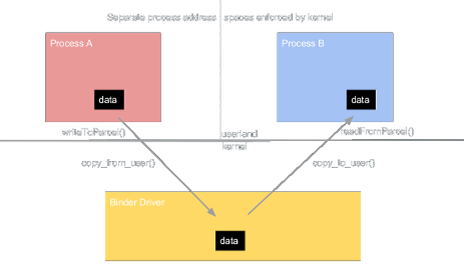
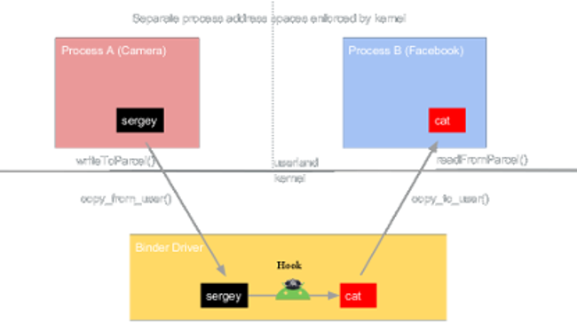

BinderFilter is a context-aware IPC firewall for Android that dynamically filters messages based on environmental data.
It can both block and modify IPC messages sent through Binder which is in a position of complete mediation in Android (including intents and permissions).

Our Binder hooking framework is able to mitigate broad classes of cross-app attacks, such as collusion and UI-based activity hijacking attacks.
Once BinderFilter is set up on an Android device, Picky, a policy application can be used to create contextual application-specific policies.

A Python IPTables-like interface is present for this purpose as well. Lua dissectors are available for analysing Binder traffic in realtime.




```bash
user:~$ ./binderfilter -s -m "android.permission.CAMERA" -u _facebook_uid_ -a 3 --modify-data="cat.jpg"
```



## [](#header-2)Blog
[Fantastic hooks and where to find them - Xposed edition](xposed).

## [](#header-2)Talks, Slides and Reports

[Technical Report](binderfilter_tr.pdf).

[Shmoocon(2017) slides presenting further BinderFilter work and an IPTables-like command line interface.](Shmoocon2017-slides.pdf).

[SummerCon(2016) presenting BinderFilter, Picky, and analysis of how Binder messages travel through the Android stack.](Summercon2016-slides.pdf).
